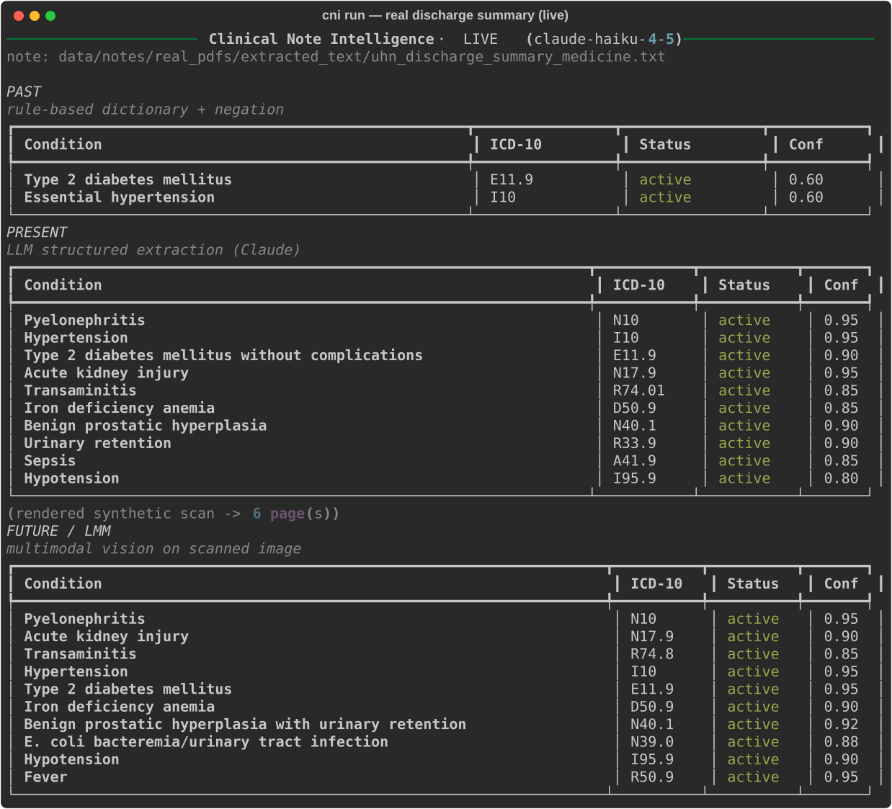
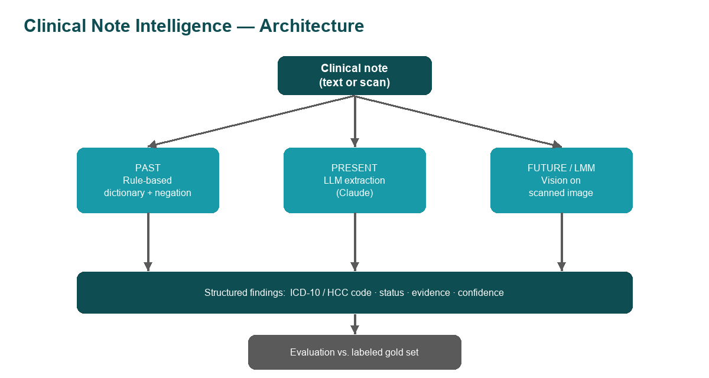

# Clinical Note Intelligence

[](https://github.com/akhilg-9/cotiviti-cni-assessment/actions/workflows/ci.yml)
[](https://www.python.org/downloads/)
[](./LICENSE)

> A three-era **maturity-ladder** demo for clinical NLP: rule-based → LLM → multimodal. Each era extracts codeable **ICD-10 / HCC** findings from the *same* clinical note, so the progression is measurable, not hand-waved.

**Candidate:** Akhil Gorantala · St. Francis College · **Topic 1 — Clinical Natural Language Technology for Health Care**
Cotiviti GenAI Science Internship — demonstration.

## Submission at a glance

| Deliverable | Location | Status |
|---|---|---|
| 📄 Written report (2 pages + APA references) | [`report.pdf`](deliverables/report.pdf) · [`report.docx`](deliverables/report.docx) | ✅ Complete |
| 🧪 Proof-of-concept (working code) | [`src/`](src/) · [`app.py`](app.py) · [`notebooks/`](notebooks/) | ✅ Complete — [benchmarks](BENCHMARKS.md), validated live on [real de-identified notes](data/notes/real_pdfs/) |
| 📊 Slide presentation | [`slides.pdf`](deliverables/slides.pdf) · [`slides.pptx`](deliverables/slides.pptx) | ✅ Complete |
| 🎥 Video walkthrough | [`deliverables/video/`](deliverables/video/) | ⏳ Recording in progress |

*PDF copies are provided so everything previews directly in the browser; the .docx/.pptx are the originals.*

### Headline result

Run live on a **real de-identified hospital discharge summary** ([UHN teaching sample](data/notes/real_pdfs/)), the three eras separate sharply:

| Era | Findings | Catches the actual discharge diagnosis (pyelonephritis, N10)? |
|:-:|--:|---|
| **Past** — rules | 2 | ❌ only dictionary terms (diabetes, hypertension) |
| **Present** — LLM | 9 | ✅ plus AKI, sepsis, BPH, urinary retention… |
| **Future** — vision | 10 | ✅ read from the scanned page images alone |

The dictionary can only find what it was told about; the LLM/LMM eras find what the chart actually says — with status, evidence, and confidence attached. Full metrics in [BENCHMARKS.md](BENCHMARKS.md); design trade-offs in [DECISIONS.md](DECISIONS.md).

Here is that exact run, live (note the guardrail: every code is checked against the official 74,719-code CMS ICD-10-CM table — across all audited real-note runs the LLM's codes are 97.8% valid, vision 92.1%, and every miss is flagged):



**Jump to:** [Why three eras](#why-three-eras) · [Architecture](#architecture) · [Quick start](#quick-start) · [Streamlit demo](#streamlit-demo) · [CLI](#cli) · [Evaluation](#evaluation) · [Configuration](#configuration) · [Deliverables](#deliverables)

---

## Why three eras

"AI for clinical text" is overloaded. This repo walks the maturity ladder deliberately, on one synthetic note:

| Era | What it is | Strength / weakness |
| :-: | :-- | :-- |
| **Past** | rule-based dictionary + regex + negation | transparent, deterministic — but brittle |
| **Present** | LLM structured extraction (Claude) | normalises, codes, reasons about context |
| **Future / LMM** | Claude *vision* reads a scanned image | removes the brittle OCR stage |

The evaluation harness runs the Past and Present passes on a labeled gold set and emits **one** table showing how detection (precision / recall / F1) and **status accuracy** change as you climb the ladder.

---

## Architecture

```
   Future / LMM  →  Claude vision on a scanned note image      ◄── multimodal
                              ▲
   Present       →  LLM structured extraction (Claude)         ◄── reasons in context
                              ▲
   Past          →  rule-based dictionary + negation           ◄── deterministic baseline
```



All sample notes are **synthetic — no real PHI**.

## Quick start

```bash
python3 -m venv .venv && source .venv/bin/activate
pip install -e ".[ui]"            # package + UI extra
cp .env.example .env              # add your ANTHROPIC_API_KEY (optional)

cni run                           # Past → Present → Future on a sample note
cni eval                          # score vs. the labeled gold set
python demo.py                    # same as `cni run`, scripted for the video
pytest                            # run the test suite
```

Without an `ANTHROPIC_API_KEY`, the Present/Future steps fall back to a clearly
labelled offline simulation so everything still runs end to end.

## Streamlit demo

```bash
streamlit run app.py
```

Side-by-side Past / Present / Future panels on an editable note — a clean
screen-share for the video.

## CLI

```
cni run [NOTE]   # extract on a note (defaults to data/notes/note1.txt)
cni eval         # precision / recall / F1 + status accuracy vs. the gold set
```

(`cni` is installed by `pip install -e .`; equivalently `python -m src.cli`.)

## Evaluation

`src/evaluation.py` scores each pass against `data/test_cases.csv`. The
rule-based pass mislabels *"hypertension … suspected, not yet confirmed"* as
active (it only looks backward for negation cues); the LLM resolves it from
context. See [`BENCHMARKS.md`](BENCHMARKS.md) for results and
[`WHAT_BROKE.md`](WHAT_BROKE.md) for the failure modes that shaped the design.

## Configuration

Prompts and model are externalised to [`prompts/v1.yaml`](prompts/v1.yaml);
bumping that file is the unit of change the eval gates on. Runtime overrides
live in `.env` (see [`.env.example`](.env.example)): `ANTHROPIC_API_KEY`,
`CNI_MODEL`, `CNI_PROMPT_VERSION`.

## Repository layout

```
src/                     The package
  rules_ner.py           PAST: rule-based dictionary + negation
  llm_extract.py         PRESENT: Claude structured extraction (+ offline fallback)
  vision_extract.py      FUTURE/LMM: Claude vision on a scanned note image
  codes.py               Condition → ICD-10 / HCC reference
  models.py              Pydantic schema + JSON schema for structured output
  config.py              .env + prompts/*.yaml loader + Claude client
  scan.py                Renders a synthetic "scanned" note image
  evaluation.py          Scores passes vs. the labeled gold set
  cli.py                 Typer CLI (`cni`)
app.py                   Streamlit UI            demo.py   Scripted one-shot demo
prompts/v1.yaml          Versioned prompt + model config
data/notes/ · test_cases.csv     Synthetic notes + labeled gold set
notebooks/               Guided Colab-friendly walkthrough
assets/diagrams/         Architecture + maturity-ladder diagrams
tests/                   Pytest suite (offline)
deliverables/            Submission artifacts: report.docx · slides.pptx · video/
docs/                    DIFFERENCES.md
```

## Deliverables

| Deliverable | Location |
|---|---|
| 📄 Written report (2 pages + references, APA) | [`deliverables/report.pdf`](deliverables/report.pdf) · [`deliverables/report.docx`](deliverables/report.docx) |
| 🧪 Proof-of-concept (code) | [`src/`](src/) · [`notebooks/`](notebooks/) |
| 📊 Slide presentation | [`deliverables/slides.pdf`](deliverables/slides.pdf) · [`deliverables/slides.pptx`](deliverables/slides.pptx) |
| 🎥 Video walkthrough | `deliverables/video/presentation.mp4` (recorded separately) |

The layout mirrors the conventions of my
[agentic-devops-triage](https://github.com/akhilg-9/agentic-devops-triage)
project (src/ + prompts/ + CI + evaluation + BENCHMARKS/WHAT_BROKE), adapted to
this submission. See [`docs/DIFFERENCES.md`](docs/DIFFERENCES.md) for the full
mapping of what was adopted and what was deliberately left out.

---
*Demonstrator prototype for evaluation only — not for clinical use.*
